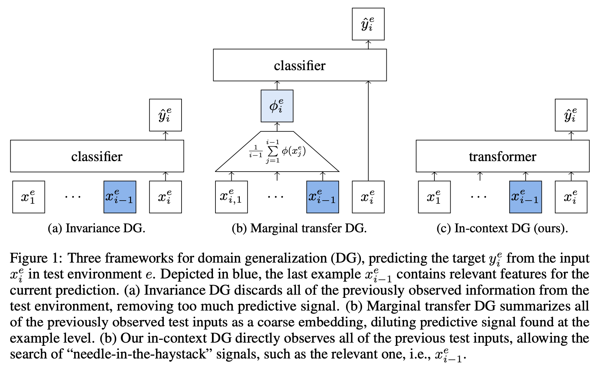
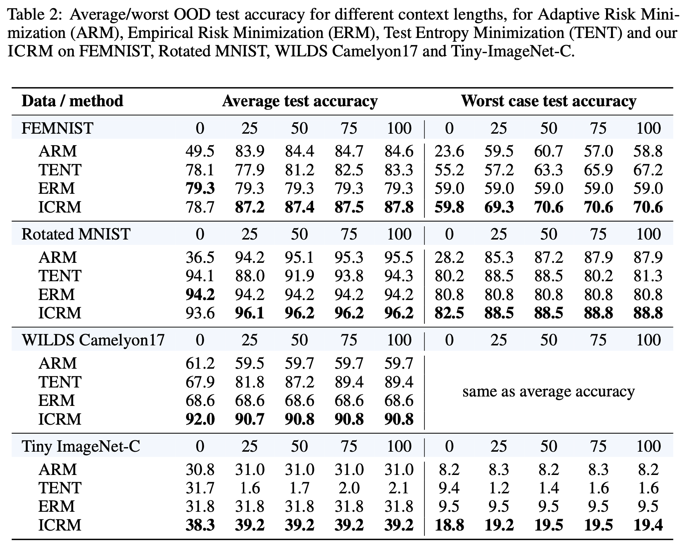

# Context is Environment
By Sharut Gupta, Stefanie Jegelka, David Lopez-Paz, Kartik Ahuja

[[Read the full paper on arXiv](https://arxiv.org/abs/2309.09888)]

Two lines of work are taking center stage in AI research. On the one hand, the community is making increasing efforts to build models that discard spurious correlations and generalize better in novel test environments. Unfortunately, a hard lesson so far is that no proposal convincingly outperforms a simple empirical risk minimization baseline. On the other hand, large language models (LLMs) have erupted as algorithms able to learn _in-context_, generalizing on-the-fly to the eclectic contextual circumstances that users enforce by prompting. We argue that _context is environment_, and posit that in-context learning holds the key to better domain generalization. Via extensive theory and experiments, we show that paying attention to context---unlabeled examples as they arrive---allows our proposed In-Context Risk Minimization (ICRM) algorithm to _zoom-in_ on the test environment risk minimizer, leading to significant out-of-distribution performance improvements. From all of this, two messages are worth taking home: researchers in domain generalization should consider _environment as context_, and harness the adaptive power of in-context learning. Researchers in LLMs should consider _context as environment_, to better structure data towards generalization.

<p align='center'>

</p>

The key contributions of this work include: 
- Establishing a strong parallel between the concept of _environment_ in domain generalization, and the concept of _context_ in next-token prediction
- Introducing In-Context Risk Minimization (ICRM), a novel algorithm that learns in-context about environmental features by paying attention to unlabeled instances (context) as they arrive
- Theoretically prove that such in-context learners can amortize context to zoom-in on the empirical risk minimizer of the test environment, achieving competitive out-of-distribution performance
- Demonstrating that in several settings, ICRM learns invariances in the extended input-context feature space that ERM-based algorithms ignore
- Empirically demonstrating the efficacy of ICRM and provide extensive ablations that dissect and deepen our understanding of it.

## ICRM: In-Context Risk Minimization

### Prerequisites
The code has the following package dependencies:
- Pytorch >= 0.13.0 (preferably 2.0.0)
- Torchvision >= 0.12.0 

To install all dependencies, create the conda environment using requirements.txt file
```
conda env create -f environment.yml
```

### Datasets
## FEMNIST
- Download train/val/test data
     - pip install gdown
     - gdown https://drive.google.com/uc?id=1xvT13Sl3vJIsC2I7l7Mp8alHkqKQIXaa
     - unzip femnist-data.zip

## Tiny ImageNet-C
- Download train/val data
    - pip install gdown
    - gdown 'https://drive.google.com/uc?id=13hd39InVa5WqPUpuoJtl9kSSwyDFyFNc'
    - unzip tinyimagenet-c.zip: This creates a directory with the name 'Tiny-ImageNet-C-new' and within it subdirectories with names 'train' and 'val'
- Download test data
    - wget -O Tiny-ImageNet-C-test.tar "https://zenodo.org/record/2536630/files/Tiny-ImageNet-C.tar?download=1"
    - tar -xvf Tiny-ImageNet-C-test.tar:  This creates a directory with the name 'Tiny-ImageNet-C'
    - mkdir Tiny-ImageNet-C-new/test/
    - mv Tiny-ImageNet-C/* Tiny-ImageNet-C-new/test/

Rotated MNIST can be downloaded using torch itself, while WILDS Camelyon is downloaded automatically using [WILDS](https://github.com/p-lambda/wilds) repository.

### Available algorithms
The [currently available algorithms](d./algorithms.py) are:
* Empirical Risk Minimization (ERM, [Vapnik, 1998](https://www.wiley.com/en-fr/Statistical+Learning+Theory-p-9780471030034))
* Adaptive Risk Minimization (ARM, [Zhang et al., 2020](https://arxiv.org/abs/2007.02931))
* Test-time Adaptation by Entropy Minimization (TENT, [Wang et al., 2021](https://openreview.net/pdf?id=uXl3bZLkr3c))
* In-Context Risk Minimization (ICRM)
* Gradient Matching for Domain Generalization (Fish, [Shi et al., 2021](https://arxiv.org/pdf/2104.09937.pdf))
* Interdomain Mixup (Mixup, [Yan et al., 2020](https://arxiv.org/abs/2001.00677))
* Invariance Principle Meets Information Bottleneck for Out-of-Distribution Generalization (IB-ERM , [Ahuja et al., 2021](https://arxiv.org/abs/2106.06607))
* Invariance Principle Meets Information Bottleneck for Out-of-Distribution Generalization (IB-IRM, [Ahuja et al., 2021](https://arxiv.org/abs/2106.06607))


## Available datasets
The [currently available datasets](./datasets.py) are:
* Federated Extended MNIST (FEMNIST, [Zhang et al., 2020](https://arxiv.org/abs/2007.02931))
* Rotated MNIST with rare groups ([Zhang et al., 2020](https://arxiv.org/abs/2007.02931))
* Tiny ImageNet-C ([Hendrycks et al., 2019](https://openreview.net/pdf?id=HJz6tiCqYm))
* WILDS ([Koh et al., 2020](https://arxiv.org/abs/2012.07421)) Camelyon17 ([Bandi et al., 2019](https://pubmed.ncbi.nlm.nih.gov/30716025/)) about tumor detection in tissues


### Quick start
Our code builds on [DomainBed](https://github.com/facebookresearch/DomainBed) and adapts most functionalities like performing sweep across algorithms and datasets, choosing top hyperparameters etc. 
Download additional datasets:

```sh
python -m download --data_dir=./data
```

Train a model:

```sh
python -m main --data_dir=./data/ --algorithm ICRM --dataset FEMNIST
```

Launch a sweep:

```sh
python -m sweep launch --data_dir=./data --output_dir=./out --command_launcher MyLauncher
```

Here, `MyLauncher` is your cluster's command launcher, as implemented in `command_launchers.py`. Currently, it supports single node multiple GPU, multiple nodes and multiple GPUs and a local code launcher. You can also implement a launcher with your specific cluster requirements in `command_launchers.py`. 
By default, the entire sweeps trains thousands of models (all algorithms x all datasets x 3 independent trials x 10 random hyper-parameter choices). To customize the sweep, the following command can be used

```sh
python -m launch\
       --data_dir=./data\
       --output_dir=./out\
       --command_launcher MyLauncher\
       --algorithms ICRM ERM\
       --datasets FEMNIST WILDSCamelyon\
       --n_hparams 5\
       --n_trials 1
```

Once all jobs conclude, succeeding or failing, there are two ways to re-launch the script
* Launch from scratch: Use `python -m sweep delete_incomplete` to remove data from the failed ones, and re-launch with `python -m sweep launch`. Ensure the same command-line arguments are used for all `sweep` calls to maintain consistency with the original jobs.
* Resume from where the run stopped: Use the exact same command previously used to run sweep. It automatically resumes all incomplete jobs by resuming from the corresponding latest checkpoint. 

To view the results of your sweep:

```sh
python -m collect_results\
       --input_dir=/my/sweep/output/path\
       --mode=<avg or wo>
```

Here `mode=avg` return average performance metrics and `mode=wo` return worst group performances. 
### Results

<p align='center'>

</p>


### License

This project is licensed under CC-BY-NC as seen in License file
